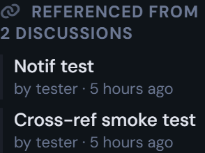
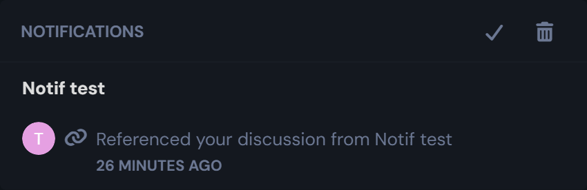

# Cross References

[](https://flarum.org/)
[](LICENSE.md)

GitHub-style cross-references between discussions and posts for **Flarum 2**.
Type `#42` in any post to link the current discussion to discussion #42 — the
target picks up a backlink, the target's author can be notified, and a sidebar
widget surfaces every inbound reference.

Built as a more robust Flarum 2 successor to
[`club-1/flarum-ext-cross-references`](https://github.com/club-1/flarum-ext-cross-references):
rename-safe rendering, visibility-aware backlinks, batched queries, and a
`references:N` search filter — all wired through Flarum 2's first-party
patterns.

---

## What it does, at a glance

### 1. Inline references render as rich chips with the live discussion title

Type `#42` in a post and it renders as a tappable chip showing the **target
discussion's current title** — pulled fresh from the database on every render,
so renames flow through automatically and you never read a stale title.


### 2. Target discussions get a backlink as a first-class event-post

When a post references another discussion, a small "Referenced from #X"
event-post appears in the target's stream — slot-in to your existing
moderation history, search index, and reply pipeline.


### 3. Every discussion gets an "inbound references" sidebar widget

A widget on the right-hand side of `DiscussionPage` lists the most recent
inbound refs, with the source author and a relative timestamp. Click an item
to jump to the referring discussion.



### 4. The target's author gets an in-app notification

The recipient sees the alert in their Flarum notification dropdown, with the
source discussion title resolved live. Self-references (when you reference
your own discussion) are silently skipped to avoid noise.



### 5. Every post header shows a copy-to-clipboard `#N` chip

So you always know which post number to use when typing `#42/pN`. Click the
chip and the canonical cross-reference (`#discussionId/pN`) is copied to
your clipboard, ready to paste into a reply.


---

## Quick start

```bash
composer require ernestdefoe/cross-references
php flarum migrate
php flarum cache:clear
```

Then **enable from the admin panel** under `Extensions → Cross References`,
grant the `Use cross-references in posts` permission to whichever groups
should be allowed to type `#42`, and you're done — references start working
immediately on new and edited posts.

---

## Usage — how to reference a discussion or a specific post

### Syntax cheat-sheet

| Type this in your post              | What renders                       | Where it points                       |
| ----------------------------------- | ---------------------------------- | ------------------------------------- |
| `#42`                               | `#42 — <Discussion Title>`         | discussion 42, top of the page        |
| `#42/p7`                            | `#42 — <Discussion Title> (post #7)` | discussion 42, post number 7        |

> **Tip:** every post header shows a clickable `#N` chip — click it to copy
> the canonical `#discussionId/pN` reference straight to your clipboard, so
> you never have to guess a post number.


| `https://forum.example.com/d/42`    | `#42 — <Discussion Title>`         | discussion 42 (URL auto-shortened)    |
| `https://forum.example.com/d/42-some-slug/7` | `#42 — <Discussion Title> (post #7)` | discussion 42, post 7        |
| `[click here](https://forum.example.com/d/42)` | a regular markdown link "click here" | preserved as-is — Markdown wins |

The `#N` form is the canonical one. Pasted forum-discussion URLs get
**rewritten to `#N` at parse time** before storage, so the database only ever
sees a single representation. URLs you explicitly wrap in markdown brackets
(`[label](url)`) are left alone — the extension assumes you meant the custom
label intentionally.

### A complete example

You're replying to a support discussion and want to link out to two related
threads — a bug report and a specific post inside a roadmap discussion:

**Write:**

```markdown
Thanks for the report! This looks like the same regression as #42, and the
fix is being planned in #58/p3. I'll close this as a duplicate once #58/p3
lands.
```

**Renders as:**

> Thanks for the report! This looks like the same regression as `#42 Login
> button stops responding on mobile`, and the fix is being planned in `#58
> Q3 roadmap (post #3)`. I'll close this as a duplicate once `#58 Q3 roadmap
> (post #3)` lands.

The chips are clickable — they navigate to `/d/42` and `/d/58/3` respectively.

**Meanwhile, in discussions #42 and #58:**

- The bug report (#42) gets a new event-post that reads `you referenced this
  from #137` (the support thread's ID).
- The roadmap (#58) gets the same event-post pointing back to #137.
- The author of #42 and the author of #58 each get an in-app notification
  alerting them that their discussion was referenced.
- The sidebar of both discussions now lists `#137` as an inbound reference.

### Visibility — references respect who can see what

References are visibility-scoped on every read path. If a viewer can't see the
target (e.g., it's in a restricted tag or a private group), the chip renders
as a muted `#42` placeholder with **no title leaked**. Backlink event-posts
inherit the target's normal visibility, so a backlink in a private thread
doesn't leak the source thread's existence to non-members.

| Viewer can see target? | Chip renders as                                         |
| ---------------------- | ------------------------------------------------------- |
| Yes                    | `#42 — <Title>` — full chip, clickable                  |
| No (private, restricted tag) | `#42` (muted, `CrossReference--hidden` class)     |

The sidebar widget applies the same scope — inbound refs from sources you
can't view simply don't appear.

### Renames are automatic

Because **titles are never persisted in the post content** — only the
discussion ID is — renaming a referenced discussion flows through to every
chip on every render. No reindex, no `chore:reparse`, no cache invalidation
needed. The next request gets the new title.

### Searching for references

Use the `references:N` filter on the discussion list to find every discussion
whose posts reference discussion #N:

```
filter[references]=42
```

Either as a URL parameter on `/api/discussions` or via the standard search
input if you've wired it (works alongside any other filter):

```
filter[references]=42&filter[tag]=support
```

Negation works too: `-references:42` excludes them.

---

## Admin settings

Under `Admin → Extensions → Cross References`, three toggles:

| Setting                                          | Default | Effect                                                                                              |
| ------------------------------------------------ | ------- | --------------------------------------------------------------------------------------------------- |
| **Show inline references in posts**              | on      | Render `#42` / pasted-URL refs as rich chips. Turn off to fall back to raw `#42` text.              |
| **Create backlink event-posts in target discussions** | on  | Insert "Referenced from #X" event-posts in the target. Disable for forums that prefer quiet target threads. |
| **Notify the target discussion's author**        | on      | Send an in-app alert when someone references the recipient's discussion. The actor never notifies themselves. |

And one permission:

- `Use cross-references in posts` — gate `#42` rendering at the group level.
  Useful for forums that want references to work only for trusted members.

---

## Architecture

### What gets stored

A single companion table `cross_references` with a row per
`(source_post, target_discussion, target_post?)` tuple. Unique constraint on
that tuple gives storage-layer dedupe — re-saving a post that mentions `#42`
three times produces one row.

```
cross_references
  id                     bigint PK
  source_post_id         FK posts.id     ON DELETE CASCADE
  source_discussion_id   FK discussions.id
  target_discussion_id   FK discussions.id  ON DELETE CASCADE
  target_post_id         FK posts.id (nullable — null = whole-discussion ref)
  created_at             timestamp
  UNIQUE (source_post_id, target_discussion_id, target_post_id)
  INDEX  (target_discussion_id)   -- inbound-refs lookup
  INDEX  (source_discussion_id)   -- outbound-refs lookup
```

The table follows Flarum 2's **companion-table convention** —
no columns added to `posts` or `discussions` (CLAUDE.md §45).

### How rendering works

1. **Parse-time**: The s9e/TextFormatter `Preg` plugin matches `\B#(\d+)\b`
   and `\B#(\d+)/p(\d+)\b` and emits `<CROSSREF id="42" postnum="7"/>` tags
   into the stored XML. Pasted forum URLs are pre-rewritten to the `#N`
   form before the parser sees them.
2. **Pre-render**: a single batched `Discussion::whereIn('id', $ids)
   ->whereVisibleTo($actor)` query resolves every referenced discussion's
   title in one round-trip. Titles + visibility flags get injected onto each
   `<CROSSREF>` tag as attributes.
3. **Render**: the XSL template uses the `title` attribute when set,
   falling back to the `CrossReference--hidden` placeholder when visibility
   denies the read.

No titles are persisted in post content. No per-post N+1 query. One DB call
per page render, regardless of how many cross-references are in the visible
posts.

### Bidirectional backlinks + notifications

The `Posted` / `Revised` event listener extracts CROSSREF tags from the
post's parsed XML, diffs against the existing `cross_references` rows for
that post, then:

- **Inserts** rows for new references; **deletes** rows for removed ones.
- For each new ref, creates a `CrossReferenceEventPost` (extending Flarum's
  `AbstractEventPost`) in the target discussion. Lives alongside core
  event-posts like "renamed" or "locked" — participates in moderation,
  search, and the standard reply pipeline.
- Optionally dispatches a `DiscussionReferencedBlueprint` notification to
  the target's author via the `alert` channel.

Self-references are silently dropped. The listener is wrapped in
`try/catch` with PSR-3 logging so a cross-ref bug can **never** block a
post save (CLAUDE.md §41).

### API endpoint

```
GET /api/discussions/{id}/cross-references
```

Returns the inbound references for a discussion, with each row
visibility-scoped against the requesting actor and eager-loaded with the
source discussion title + first-post author. Capped at 50 rows — the
response includes a `meta.capped50` boolean so a future "view all" page can
fall back to a paginated source.

```json
{
  "data": [
    {
      "id": 1,
      "sourceDiscussionId": 6,
      "sourcePostId": 4,
      "targetPostId": null,
      "createdAt": "2026-05-17T13:59:39+00:00",
      "source": {
        "discussionTitle": "Cross-ref smoke test",
        "discussionSlug": "cross-ref-smoke-test",
        "author": {
          "id": 2,
          "displayName": "tester",
          "username": "tester",
          "avatarUrl": null
        }
      }
    }
  ],
  "meta": { "count": 1, "capped50": false }
}
```

### Search filter

Registered via `Extend\SearchDriver(DatabaseSearchDriver)
->addFilter(DiscussionSearcher, ReferencesFilter)`. The value is cast to
`(int)` before reaching SQL — defeats the §10 wildcard / sort-allowlist
trap surface; the gambit accepts numeric ids only, never strings.

---

## Comparison vs. `club-1/flarum-ext-cross-references`

| Concern                                     | `club-1/cross-references`        | `ernestdefoe/cross-references`              |
| ------------------------------------------- | -------------------------------- | ------------------------------------------- |
| Flarum version                              | 1.x                              | 2.x                                         |
| Discussion title in chip                    | Baked into post content at save  | Resolved live from DB on every render       |
| Behavior on target rename                   | Requires `chore:reparse` to refresh stored chips | Automatic — chips read current title |
| Behavior on target delete                   | Plain link to nothing            | Chip renders as muted `#N` placeholder      |
| Visibility-aware                            | No (leaks restricted titles)     | Yes — `whereVisibleTo($actor)` everywhere   |
| Backlink mechanism                          | Event post                       | Event post (first-class, extends `AbstractEventPost`) |
| Notifications to target author              | No                               | Yes — `AlertableInterface` blueprint        |
| Inbound-refs sidebar widget                 | No                               | Yes                                          |
| Search filter (`references:N`)              | No                               | Yes                                          |
| Per-post listener failures block post save  | Possible                         | Caught + logged, never blocks save          |
| Dedupe                                      | None                             | Unique index at storage layer               |

---

## Architecture notes (for extension authors reading this for reference)

This extension was built against the Flarum 2 security/structure playbook —
relevant sections:

- **§5** — `whereVisibleTo($actor)` applied at every read path (API endpoint,
  render-time enrichment, search filter sub-query). Inbound-refs sidebar
  filters source visibility per actor before payload assembly.
- **§19** — `getData()` carries IDs only; titles re-resolved from the
  subject relation at render time so a target that turns private later
  doesn't leak its old title via a stale notification.
- **§26** — Migration uses `Flarum\Database\Migration::createTableIfNotExists`
  with explicit `cascadeOnDelete` FKs and a composite unique index for
  storage-layer dedupe.
- **§38** — Single batched query per render to resolve all titles for a
  post; one batched visibility check for the sidebar. No N+1.
- **§41** — `Psr\Log\LoggerInterface` injected in the listener + controller;
  try/catch wraps both so a ref bug can never block a post save.
- **§43** — `composer.json` constrained to `"flarum/core": "^2.0"`; no
  `^1.0` fallback, since v2-only `Endpoint`/`Schema` classes are imported.
- **§45** — Companion `cross_references` table; **no** columns added to
  core `posts`/`discussions`/`users`.
- **§46** — `DiscussionReferencedBlueprint` has a typed constructor +
  `TYPE` class constant + `getSubjectModel()` returns `Discussion::class`,
  so the polymorphic `subject` relationship resolves cleanly via
  `typeForModel()`.

---

## Contributing

Pull requests welcome. For non-trivial changes, please open an issue first
so we can discuss the approach.

- `composer require ernestdefoe/cross-references:dev-main` (or path repo) in
  your local Flarum to develop against.
- `cd js && npm install && npm run dev` watches and rebuilds the JS bundle
  on every change.
- `php flarum cache:clear` after PHP changes.

## License

[MIT](LICENSE.md) © Ernestdefoe
